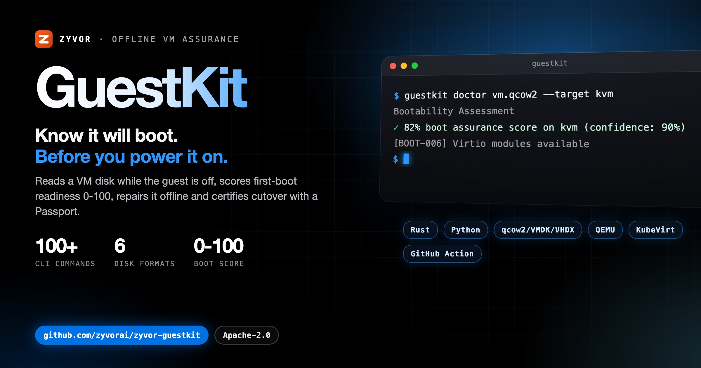

<div align="center">



# GuestKit

### Offline VM intelligence and migration assurance.

Score boot readiness before power-on, repair disks offline, and certify cutover with a Passport.

[](https://github.com/zyvorai/zyvor-guestkit/actions/workflows/ci.yml)
[](https://crates.io/crates/guestkit)
[](https://pypi.org/project/zyvor-guestkit/)
[](LICENSE)
[](https://github.com/orgs/zyvorai/packages)

**[Book a demo](https://zyvor.dev/schedule?utm_source=github&utm_medium=guestkit&utm_campaign=readme_hero)** · **[Start a 30-day PoC](https://zyvor.dev/poc?utm_source=github&utm_medium=guestkit&utm_campaign=readme_hero)** · [30-day Enterprise trial](docs/enterprise-trial-install.md)

[**Quick start**](#quick-start) · [**Gallery**](docs/gallery.md) · [**Docs**](https://zyvorai.github.io/zyvor-guestkit/) · [**Product**](https://zyvor.dev/guestkit?utm_source=github&utm_medium=guestkit&utm_campaign=readme_hero) · [**Wiki**](https://github.com/zyvorai/zyvor-guestkit/wiki) · [**FluxVM**](https://github.com/zyvorai/zyvor-fluxvm) · [**h2kvm**](https://github.com/zyvorai/zyvor-h2kvm)

</div>

---

## Know it will boot. Before you power it on.

GuestKit reads a VM disk **while the guest is off** — qcow2, VMDK, VHDX, VHD, VDI or raw — through its own pure-Rust engine (NBD or loop mount). There is no appliance daemon and no "power it on and see". It scores first-boot probability 0–100, explains the blockers, and writes a reviewable fix plan.

Fixes are never implicit. Repairs go through a plan you can read, applied with backups and rollback, and the same score drives the CI gate, the signed Cutover Passport, and assured QEMU launch.

<div align="center">


<sub>The bundled OSS web console rendering its offline demo data, not a live deployment. More in the <a href="docs/gallery.md">gallery</a>.</sub>

</div>

<a id="-see-it-in-action"></a>

<table>
<tr>
<td valign="top" width="33%">
<b>Boot-readiness scoring</b><br>
First-boot probability 0–100, the blockers explained, and a reviewable fix plan.<br>
<a href="docs/cutover-offline.md">The cutover problem</a>
</td>
<td valign="top" width="33%">
<b>Offline repair</b><br>
Repairs go through a plan you can read, applied with backups and rollback.<br>
<a href="docs/capabilities.md">What you can do</a>
</td>
<td valign="top" width="33%">
<b>Migration assurance</b><br>
The same score drives the CI gate, the signed Cutover Passport and assured QEMU launch.<br>
<a href="docs/quick-start.md">Quick start</a>
</td>
</tr>
<tr>
<td valign="top" width="33%">
<b>Engine and formats</b><br>
A pure-Rust engine over qcow2, VMDK, VHDX, VHD, VDI and raw, through NBD or loop mount.<br>
<a href="docs/platform-layout.md">Platform layout</a>
</td>
<td valign="top" width="33%">
<b>Suite hand-offs</b><br>
Export with Transiva, convert and deploy with h2kvm, assure with GuestKit, operate on Zorvia or Zeus OS.<br>
<a href="docs/who-does-what.md">Who does what</a>
</td>
<td valign="top" width="33%">
<b>CLI, TUI, web, CI</b><br>
CLI, TUI, QEMU, Python, web console, in-guest agent and a GitHub Action.<br>
<a href="docs/web-stack-ghcr.md">Run the web stack</a>
</td>
</tr>
</table>

<div align="center">

**70+** commands · **6** disk formats · **0** appliance daemons · **8** migration targets · **Apache-2.0**

</div>

---

<a id="quick-start"></a>

## 60-second quick start

```bash
# v1.2.5 GitHub Release — crates.io `guestkit` is still 0.3.2
curl -fsSL -O https://github.com/zyvorai/zyvor-guestkit/releases/download/v1.2.5/guestkit-1.2.5-linux-amd64.tar.gz

guestkit doctor vm.qcow2 --target proxmox --explain
guestkit migrate-plan vm.vmdk --target kvm --export plan.yaml
guestkit passport emit vm.qcow2 --target kvm -o passport.json
guestctl tui vm.qcow2           # Assurance · preview · export
guestkit-qemu plan vm.qcow2 --json   # assurance → QEMU definition
```

**CI gate** — same score, no CLI install step:

```yaml
- uses: zyvorai/guestkit@v1
  with:
    disk: vm.qcow2
    target: kvm
    fail-below: '80'
```

Targets: `kvm` · `proxmox` · `qemu` · `kubevirt` · `aws` · `azure` · `gcp` · `hyperv`. Host needs: Linux with `qemu-img`, `losetup`, and `qemu-nbd` (mount/repair may need root).

Python (v1.1.0+), on **[PyPI](https://pypi.org/project/zyvor-guestkit/)**: `pip install zyvor-guestkit`, then `guestkit.run_doctor("vm.qcow2", target="kvm", explain=True)`. The full quick start, shrink and Python examples: [docs/quick-start.md](docs/quick-start.md).

---

## The cutover problem, solved offline

Every hypervisor exit fails the same way: you discover the disk was broken **at 2am**, in the cutover window, after power-on. GuestKit reads the disk **while the guest is off**, scores first-boot probability 0–100, and emits a reviewable fix plan.

```text
  disk.qcow2 / .vmdk / .vhdx / .vhd / .vdi / .raw
                    │
                    ▼
         ┌──────────────────────┐
         │  Pure-Rust engine    │──►  doctor 0–100 + blockers
         │  NBD / loop mount    │──►  migrate-plan YAML
         └──────────────────────┘──►  Passport · repair · CI gate
                    │                 guestkit-qemu (assured launch)
      CLI · TUI · QEMU · Python · Web · Agent · GitHub Action
```

<div align="center">

<picture>
  <source media="(prefers-color-scheme: dark)" srcset="docs/social/migration-1200x630-dark.png">
  
</picture>

</div>

**Export with [Transiva](https://github.com/zyvorai/zyvor-transiva) (Apache-2.0) → convert & deploy with [h2kvm](https://github.com/zyvorai/zyvor-h2kvm) (Zyvor Production License) → assure with [GuestKit](https://github.com/zyvorai/zyvor-guestkit) (Apache-2.0) → operate on [Zorvia](https://github.com/zyvorai/zyvor-zorvia/blob/main/docs/leave-openshift.md) or [Zeus OS](https://zyvor.dev/zeus-os?utm_source=github&utm_medium=guestkit&utm_campaign=readme_suite).** Run and manage VMs with [FluxVM](https://github.com/zyvorai/zyvor-fluxvm). [Who does what](docs/who-does-what.md) · [h2kvm integration](docs/h2kvm-at-a-glance.md)

<a id="why-teams-switch"></a>

## Why teams switch

| Before GuestKit | With GuestKit |
|-----------------|---------------|
| “Will it boot?” answered at power-on | Offline **doctor** score + root-cause chain |
| guestkit scripts and tribal knowledge | Structured plans, JSON/YAML, CI gates |
| Surprises on cutover weekend | Hypervisor-aware **migrate-plan** + day-0 packs |
| No audit trail MTV / virt-v2v can skip | Signed **Cutover Passport** |
| Migration order guessed by hand | `fleet wave-plan` — dependency-aware waves |

The [full comparison](docs/why-teams-switch.md) has four more rows.

---

## Open source, Enterprise

**Open source — free under Apache-2.0.** This repo · personal, lab, and commercial production. Full offline **doctor**, migrate-plan, repair, fleet, policy · CLI · TUI · Python · self-hosted web/workers.

**Enterprise — buy for programs.** Same engine — **not** a locked doctor. Command Center · Portfolio · Assurance · Migration Factory · Passport Authority · OIDC / RBAC / audit · SLA · air-gap · hypervisor exit workshops.

[Open source vs Enterprise](docs/oss-vs-enterprise.md) · [Full feature matrix](docs/ce-vs-enterprise.md) · [30-day Enterprise trial](docs/enterprise-trial-install.md) · [Pricing](https://zyvor.dev/pricing?utm_source=github&utm_medium=guestkit&utm_campaign=readme_edition)

**Trial expired or want a guided evaluation?** [Book a demo](https://zyvor.dev/schedule?utm_source=github&utm_medium=guestkit&utm_campaign=readme_edition) or [start a 30-day PoC](https://zyvor.dev/poc?utm_source=github&utm_medium=guestkit&utm_campaign=readme_edition) — no email needed. [sales@zyvor.dev](mailto:sales@zyvor.dev) remains as a fallback.

<a id="documentation"></a>

## Documentation

| Goal | Document |
|------|----------|
| Docs site | [zyvorai.github.io/zyvor-guestkit](https://zyvorai.github.io/zyvor-guestkit/) |
| Docs home | [docs/README.md](docs/README.md) · [INDEX](docs/INDEX.md) |
| DevOps runbooks | [docs/devops](docs/devops/README.md) |
| Feature guide | [guestkit-user-feature-guide.md](docs/guestkit-user-feature-guide.md) |
| h2kvm integration | [h2kvm integration](docs/features/hyper2kvm-integration.md) |
| QEMU / VirtIO runtime | [qemu-runtime.md](docs/features/qemu-runtime.md) |
| Dump virsh → GuestKit | [virsh-to-guestkit.md](docs/user-guides/virsh-to-guestkit.md) |
| Architecture | [overview](docs/architecture/overview.md) |

The complete map, with the changelog and roadmap, is in [docs/documentation-map.md](docs/documentation-map.md).

## Go deeper

- <a id="gallery"></a>**Gallery:** console screenshots and demo videos — [docs/gallery.md](docs/gallery.md).
- <a id="the-cutover-problem--solved-offline"></a><a id="who-does-what-users"></a>**Who does what:** the suite split and the libvirt/virsh map — [docs/who-does-what.md](docs/who-does-what.md).
- <a id="h2kvm-integration"></a>**h2kvm integration:** [docs/h2kvm-at-a-glance.md](docs/h2kvm-at-a-glance.md).
- <a id="what-you-can-do"></a>**What you can do:** assure, plan, certify, repair, launch — [docs/capabilities.md](docs/capabilities.md).
- <a id="run-the-free-web-stack-ghcr"></a>**Free web stack (GHCR):** [docs/web-stack-ghcr.md](docs/web-stack-ghcr.md).
- <a id="open-source-vs-enterprise"></a>**Open source vs Enterprise:** [docs/oss-vs-enterprise.md](docs/oss-vs-enterprise.md).
- <a id="platform-layout"></a>**Platform layout:** [docs/platform-layout.md](docs/platform-layout.md).
- <a id="repository"></a>**Repository:** [docs/repository-layout.md](docs/repository-layout.md).
- <a id="prerequisites"></a><a id="build"></a>**Prerequisites and build:** [docs/prerequisites-and-build.md](docs/prerequisites-and-build.md); `docs/` and this README are authoritative.

---

## License

Commercial subscriptions and support: see [docs/SUBSCRIPTION-MODEL.md](docs/SUBSCRIPTION-MODEL.md).

### Open source (Apache-2.0)

This repository is licensed under the [Apache License, Version 2.0](LICENSE).
You may use, modify, and run it for personal, lab, and commercial production
use at no charge, subject to Apache-2.0 (preserve notices / NOTICE where required).
See [NOTICE](NOTICE) and `docs/legal/` where applicable.

### Enterprise

Production support, SLAs, and Zyvor Enterprise products are licensed separately.
[Book a demo](https://zyvor.dev/schedule?utm_source=github&utm_medium=guestkit&utm_campaign=readme_footer), [start a 30-day PoC](https://zyvor.dev/poc?utm_source=github&utm_medium=guestkit&utm_campaign=readme_footer), or see [zyvor.dev](https://zyvor.dev/?utm_source=github&utm_medium=guestkit&utm_campaign=readme_footer). Email [sales@zyvor.dev](mailto:sales@zyvor.dev) as a fallback.

<div align="center">

More at **[zyvor.dev/guestkit](https://zyvor.dev/guestkit?utm_source=github&utm_medium=guestkit&utm_campaign=readme_footer)** · [docs](https://zyvor.dev/docs?utm_source=github&utm_medium=guestkit&utm_campaign=readme_footer) · [blog](https://zyvor.dev/blog?utm_source=github&utm_medium=guestkit&utm_campaign=readme_footer)

</div>
