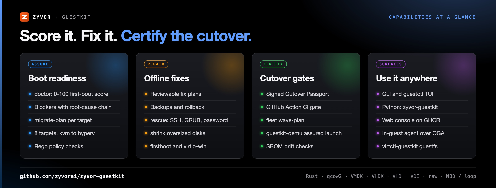
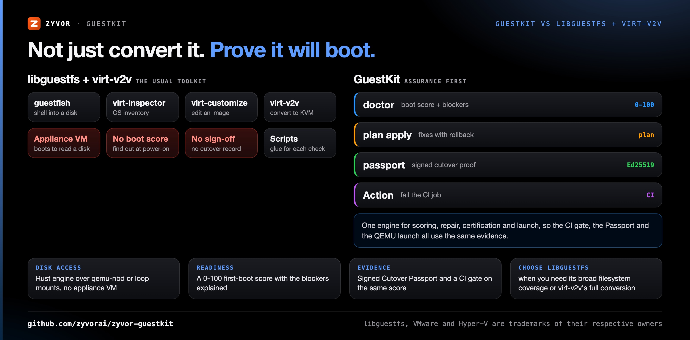
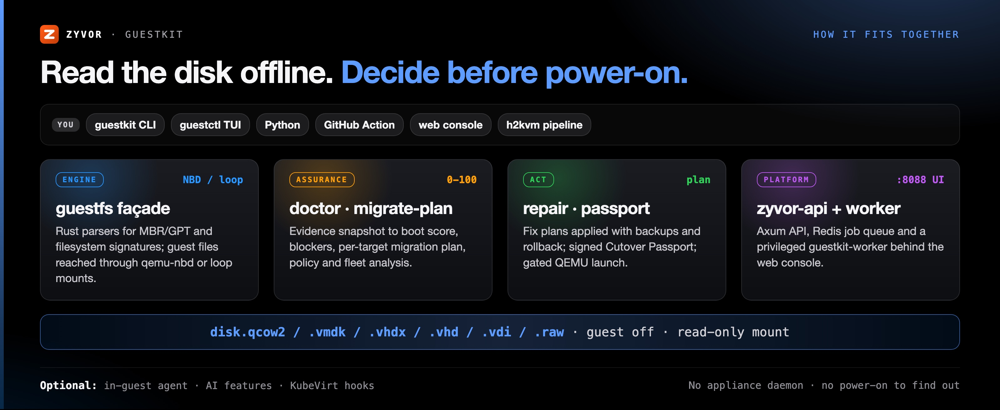

<div align="center">

# GuestKit

[](https://github.com/zyvorai/zyvor-guestkit/actions/workflows/ci.yml)
[](https://crates.io/crates/guestkit)
[](https://pypi.org/project/zyvor-guestkit/)
[](LICENSE)
[](Cargo.toml)
[](https://github.com/orgs/zyvorai/packages)
[](https://zyvorai.github.io/zyvor-guestkit/)

[](https://zyvor.dev/schedule?utm_source=github&utm_medium=guestkit&utm_campaign=readme_hero)
[](https://zyvor.dev/poc?utm_source=github&utm_medium=guestkit&utm_campaign=readme_hero)
[](#quickstart)


### Know it will boot. Before you power it on.

**Offline VM intelligence and migration assurance.** GuestKit reads a VM disk while the guest is off, scores first-boot readiness 0–100, repairs it through a plan you can read, and certifies cutover with a signed Passport.

**6 disk formats** · **0–100 boot score** · **0 appliance daemons** · **8 migration targets** · **Apache-2.0**

[Gallery](docs/gallery.md) · [Docs](https://zyvorai.github.io/zyvor-guestkit/) · [Product](https://zyvor.dev/guestkit?utm_source=github&utm_medium=guestkit&utm_campaign=readme_hero) · [Wiki](https://github.com/zyvorai/zyvor-guestkit/wiki) · [30-day Enterprise trial](docs/enterprise-trial-install.md)

</div>

---

## What's new

| Release | What changed |
|---|---|
| **Agent (main)** | Per-container eBPF network policy and BPF-LSM controls in the guest agent (`guestkit.netpolicy` / `guestkit.lsm`), off by default, audit first, enforce only under a time-bound lease |
| **1.2.5** | Offline inject on `run_migrate_repair`: hostname, network, users, services, first-boot scripts, cloud-init, AD rejoin, Windows KMS and RDP, appended to the repair plan |
| **1.2.5** | Online snapshots freeze the filesystem through the privileged helper, so KubeVirt snapshots of PVC-backed VMs work with the unprivileged agent |
| **1.2.5** | Linux agent connects to the virtio channel on stock distros (udev rule shipped in DEB, RPM and tarball); concurrent NBD mounts no longer race |
| **1.2.2** | Web Image Vault reaches TUI parity: inventory tabs, Assurance (plan, passport, repair preview and gated apply), Profiles and Files |
| **1.2.0** | `guestkit-qemu` assured QEMU/VirtIO runtime, `guestkit vm`, `virtctl-guestkit guestfs`, the cutover bundle and `guestkit shrink` for oversized disks |

Full history: [CHANGELOG.md](CHANGELOG.md).

## Why GuestKit

Every hypervisor exit fails the same way: you discover the disk was broken **at 2am**, in the cutover window, after power-on. GuestKit reads the disk **while the guest is off** — qcow2, VMDK, VHDX, VHD, VDI or raw — through its own pure-Rust engine (NBD or loop mount). There is no appliance daemon and no "power it on and see".

| When this happens… | GuestKit gives you… |
|---|---|
| "Will it boot?" is answered at power-on | An offline **doctor** score (0–100) with a root-cause chain for each blocker |
| Each migration relies on scripts and tribal knowledge | Structured plans in JSON/YAML and a CI gate on the same score |
| Cutover weekend is full of surprises | Hypervisor-aware **migrate-plan** and day-0 packs, for 8 targets |
| There is no audit trail of what was checked | A signed **Cutover Passport** per disk |
| Repairs are hand edits inside a mounted image | Fix plans you can read, applied with backups and rollback |
| Migration order is guessed by hand | `fleet wave-plan`: dependency-aware waves |

Fixes are never implicit. Repairs go through a plan you can read, applied with backups and rollback, and the same score drives the CI gate, the signed Cutover Passport, and assured QEMU launch.

<a id="-see-it-in-action"></a>

<table>
<tr>
<td valign="top" width="33%">
<b>Boot-readiness scoring</b><br>
First-boot probability 0–100, the blockers explained, and a reviewable fix plan.<br>
<a href="docs/cutover-offline.md">The cutover problem</a>
</td>
<td valign="top" width="33%">
<b>Offline repair</b><br>
Repairs go through a plan you can read, applied with backups and rollback.<br>
<a href="docs/capabilities.md">What you can do</a>
</td>
<td valign="top" width="33%">
<b>Migration assurance</b><br>
The same score drives the CI gate, the signed Cutover Passport and assured QEMU launch.<br>
<a href="docs/quick-start.md">Quick start</a>
</td>
</tr>
<tr>
<td valign="top" width="33%">
<b>Engine and formats</b><br>
A pure-Rust engine over qcow2, VMDK, VHDX, VHD, VDI and raw, through NBD or loop mount.<br>
<a href="docs/platform-layout.md">Platform layout</a>
</td>
<td valign="top" width="33%">
<b>Suite hand-offs</b><br>
Export with Transiva, convert and deploy with h2kvm, assure with GuestKit, operate on Zorvia or Zeus OS.<br>
<a href="docs/who-does-what.md">Who does what</a>
</td>
<td valign="top" width="33%">
<b>CLI, TUI, web, CI</b><br>
CLI, TUI, QEMU, Python, web console, in-guest agent and a GitHub Action.<br>
<a href="docs/web-stack-ghcr.md">Run the web stack</a>
</td>
</tr>
</table>

<div align="center">

**70+** commands · **6** disk formats · **0** appliance daemons · **8** migration targets · **Apache-2.0**

</div>



<a id="why-teams-switch"></a>

The [full comparison](docs/why-teams-switch.md) has more rows, including fleet drift, the Carbon TUI with the in-guest agent, and `guestkit qga` as a drop-in for `virsh qemu-agent-command`.

---

## GuestKit vs libguestfs + virt-v2v



| | **GuestKit** | **libguestfs + virt-v2v** |
|---|---|---|
| Disk access | Rust engine; guest files reached through `qemu-nbd` or loop mounts on the host | Launches a small appliance VM to read and edit the disk |
| Boot readiness | `doctor`: a 0–100 first-boot score per target, with blockers explained | Inspection and conversion; no readiness score |
| Migration plan | `migrate-plan` per target (`kvm`, `proxmox`, `qemu`, `kubevirt`, `aws`, `azure`, `gcp`, `hyperv`) | `virt-v2v` converts a guest to run on KVM |
| Repair | Fix plans with backups and rollback; `rescue` for SSH, GRUB and passwords | `virt-customize`, `virt-rescue` and `guestfish` for scripted edits |
| Cutover evidence | Signed Cutover Passport and a GitHub Action that fails below a score | Not part of the toolkit |
| Interfaces | CLI, TUI, Python, web console, in-guest agent, GitHub Action | CLI tools and language bindings |
| **Choose libguestfs when** | | You need its broad filesystem and OS coverage, or virt-v2v's end-to-end conversion, and have no need for a score or a cutover record |

GuestKit sits next to conversion tools rather than replacing all of them: [h2kvm](https://github.com/zyvorai/zyvor-h2kvm) converts and deploys, and calls GuestKit for the offline fixes.

---

## See it live

<div align="center">


<sub>Assurance: doctor score 78, a REVIEW decision, and ranked findings with a fix command each.</sub>


<sub>Summary: OS identity and inventory counts from inspect.</sub>


<sub>Image Vault: import a disk, or try the offline demo.</sub>

<sub>The bundled OSS web console rendering its offline demo data, not a live deployment. Demo videos are in the <a href="docs/gallery.md">gallery</a>.</sub>

</div>

---

## How it fits together



<a id="the-cutover-problem--solved-offline"></a>

```text
  disk.qcow2 / .vmdk / .vhdx / .vhd / .vdi / .raw
                    │
                    ▼
         ┌──────────────────────┐
         │  Pure-Rust engine    │──►  doctor 0–100 + blockers
         │  NBD / loop mount    │──►  migrate-plan YAML
         └──────────────────────┘──►  Passport · repair · CI gate
                    │                 guestkit-qemu (assured launch)
      CLI · TUI · QEMU · Python · Web · Agent · GitHub Action
```

<div align="center">

<picture>
  <source media="(prefers-color-scheme: dark)" srcset="docs/social/migration-1200x630-dark.png">
  
</picture>

</div>

**Export with [Transiva](https://github.com/zyvorai/zyvor-transiva) (Apache-2.0) → convert & deploy with [h2kvm](https://github.com/zyvorai/zyvor-h2kvm) (Zyvor Production License) → assure with [GuestKit](https://github.com/zyvorai/zyvor-guestkit) (Apache-2.0) → operate on [Zorvia](https://github.com/zyvorai/zyvor-zorvia/blob/main/docs/leave-openshift.md) or [Zeus OS](https://zyvor.dev/zeus-os?utm_source=github&utm_medium=guestkit&utm_campaign=readme_suite).** Run and manage VMs with [FluxVM](https://github.com/zyvorai/zyvor-fluxvm). [Who does what](docs/who-does-what.md) · [h2kvm integration](docs/h2kvm-at-a-glance.md)

Architecture in depth: [docs/architecture/overview.md](docs/architecture/overview.md).

---

<a id="quick-start"></a>

## Quickstart

```bash
# v1.2.5 GitHub Release — crates.io `guestkit` is still 0.3.2
curl -fsSL -O https://github.com/zyvorai/zyvor-guestkit/releases/download/v1.2.5/guestkit-1.2.5-linux-amd64.tar.gz

guestkit doctor vm.qcow2 --target proxmox --explain
guestkit migrate-plan vm.vmdk --target kvm --export plan.yaml
guestkit passport emit vm.qcow2 --target kvm -o passport.json
guestctl tui vm.qcow2           # Assurance · preview · export
guestkit-qemu plan vm.qcow2 --json   # assurance → QEMU definition
```

**CI gate** — same score, no CLI install step:

```yaml
- uses: zyvorai/guestkit@v1
  with:
    disk: vm.qcow2
    target: kvm
    fail-below: '80'
```

Targets: `kvm` · `proxmox` · `qemu` · `kubevirt` · `aws` · `azure` · `gcp` · `hyperv`. Host needs: Linux with `qemu-img`, `losetup`, and `qemu-nbd` (mount/repair may need root).

Python (v1.1.0+), on **[PyPI](https://pypi.org/project/zyvor-guestkit/)**: `pip install zyvor-guestkit`, then `guestkit.run_doctor("vm.qcow2", target="kvm", explain=True)`. The full quick start, shrink and Python examples: [docs/quick-start.md](docs/quick-start.md).

---

<a id="documentation"></a>

## Documentation

| Goal | Document |
|------|----------|
| Docs site | [zyvorai.github.io/zyvor-guestkit](https://zyvorai.github.io/zyvor-guestkit/) |
| Docs home | [docs/README.md](docs/README.md) · [INDEX](docs/INDEX.md) |
| DevOps runbooks | [docs/devops](docs/devops/README.md) |
| Feature guide | [guestkit-user-feature-guide.md](docs/guestkit-user-feature-guide.md) |
| h2kvm integration | [h2kvm integration](docs/features/hyper2kvm-integration.md) |
| QEMU / VirtIO runtime | [qemu-runtime.md](docs/features/qemu-runtime.md) |
| Dump virsh → GuestKit | [virsh-to-guestkit.md](docs/user-guides/virsh-to-guestkit.md) |
| Architecture | [overview](docs/architecture/overview.md) |

The complete map, with the changelog and roadmap, is in [docs/documentation-map.md](docs/documentation-map.md).

## Go deeper

- <a id="gallery"></a>**Gallery:** console screenshots and demo videos — [docs/gallery.md](docs/gallery.md).
- <a id="who-does-what-users"></a>**Who does what:** the suite split and the libvirt/virsh map — [docs/who-does-what.md](docs/who-does-what.md).
- <a id="h2kvm-integration"></a>**h2kvm integration:** [docs/h2kvm-at-a-glance.md](docs/h2kvm-at-a-glance.md).
- <a id="what-you-can-do"></a>**What you can do:** assure, plan, certify, repair, launch — [docs/capabilities.md](docs/capabilities.md).
- <a id="run-the-free-web-stack-ghcr"></a>**Free web stack (GHCR):** [docs/web-stack-ghcr.md](docs/web-stack-ghcr.md).
- <a id="open-source-vs-enterprise"></a>**Open source vs Enterprise:** [docs/oss-vs-enterprise.md](docs/oss-vs-enterprise.md).
- <a id="platform-layout"></a>**Platform layout:** [docs/platform-layout.md](docs/platform-layout.md).
- <a id="repository"></a>**Repository:** [docs/repository-layout.md](docs/repository-layout.md).
- <a id="prerequisites"></a><a id="build"></a>**Prerequisites and build:** [docs/prerequisites-and-build.md](docs/prerequisites-and-build.md); `docs/` and this README are authoritative.

## Open source, Enterprise

**Open source — free under Apache-2.0.** This repo · personal, lab, and commercial production. Full offline **doctor**, migrate-plan, repair, fleet, policy · CLI · TUI · Python · self-hosted web/workers.

**Enterprise — buy for programs.** Same engine — **not** a locked doctor. Command Center · Portfolio · Assurance · Migration Factory · Passport Authority · OIDC / RBAC / audit · SLA · air-gap · hypervisor exit workshops.

[Open source vs Enterprise](docs/oss-vs-enterprise.md) · [Full feature matrix](docs/ce-vs-enterprise.md) · [30-day Enterprise trial](docs/enterprise-trial-install.md) · [Pricing](https://zyvor.dev/pricing?utm_source=github&utm_medium=guestkit&utm_campaign=readme_edition)

**Trial expired or want a guided evaluation?** [Book a demo](https://zyvor.dev/schedule?utm_source=github&utm_medium=guestkit&utm_campaign=readme_edition) or [start a 30-day PoC](https://zyvor.dev/poc?utm_source=github&utm_medium=guestkit&utm_campaign=readme_edition) — no email needed. [sales@zyvor.dev](mailto:sales@zyvor.dev) remains as a fallback.

---

## Maturity

GuestKit is at **v1.2.5** (GitHub Release; PyPI `zyvor-guestkit`; crates.io `guestkit` is still 0.3.2). The architecture overview states the engine's scope plainly:

| Area | Status |
|---|---|
| Pure-Rust parsing: partition tables, filesystem signatures, evidence schema, boot engine, assurance APIs | Shipped |
| Web UI (`deploy/ui`: inventory, Assurance, Profiles, Files), GHCR `zyvor-ui` | Shipped |
| In-process QCOW2 read | Partial: format detection and selective reads; full cluster walk defers to `qemu-nbd` |
| File access inside guests | Through loop devices / `qemu-nbd` and a host mount, not in-process ext4/NTFS parsers |
| `guestkit shrink` | Narrow by design: a single/last ext2/3/4 partition, MBR or GPT, no LVM/LUKS; other layouts are reported and left untouched |
| GHCR web stack (`deploy/docker-compose.ghcr.yml`) | Eval only: unauthenticated, do not expose beyond localhost |
| Guest-agent eBPF policy and LSM | Opt-in: gated by `capabilities.ebpf`, off by default |

---

## Part of the Zyvor stack

| Product | Role next to GuestKit |
|---|---|
| **GuestKit** | Offline VM assurance: boot score, repair, Cutover Passport |
| **[Transiva](https://github.com/zyvorai/zyvor-transiva)** | Exports VMs out of the source hypervisor, upstream of GuestKit |
| **[h2kvm](https://github.com/zyvorai/zyvor-h2kvm)** | Converts and deploys to KVM; uses the GuestKit Python package for offline fixes |
| **[Zorvia](https://github.com/zyvorai/zyvor-zorvia)** | KubeVirt VM platform to operate the migrated VMs |
| **[FluxVM](https://github.com/zyvorai/zyvor-fluxvm)** | Runs and manages VMs; production run, network and TTL sit there, not in `guestkit vm` |

→ [zyvor.dev](https://zyvor.dev)

---

## License

GuestKit is **free and open source** under the [Apache License, Version 2.0](LICENSE). You may use, modify, and run it for personal, lab, and commercial production use at no charge, subject to Apache-2.0 (preserve notices / NOTICE where required). See [NOTICE](NOTICE) and `docs/legal/` where applicable. That does not change.

**Zyvor Enterprise** adds what production teams ask for: supported releases, deployment and upgrade guidance, priority incident triage, a named technical contact and 24x7 critical intake. Production support, SLAs, and Zyvor Enterprise products are licensed separately. Plans and terms: [docs/SUBSCRIPTION-MODEL.md](docs/SUBSCRIPTION-MODEL.md) · [Pricing](https://zyvor.dev/pricing?utm_source=github&utm_medium=guestkit&utm_campaign=readme_license) · [sales@zyvor.dev](mailto:sales@zyvor.dev).

Report vulnerabilities privately per [SECURITY.md](SECURITY.md). More at [zyvor.dev/guestkit](https://zyvor.dev/guestkit?utm_source=github&utm_medium=guestkit&utm_campaign=readme_footer) · [docs](https://zyvor.dev/docs?utm_source=github&utm_medium=guestkit&utm_campaign=readme_footer) · [blog](https://zyvor.dev/blog?utm_source=github&utm_medium=guestkit&utm_campaign=readme_footer).

---

<div align="center">

### Know every disk will boot before cutover weekend

[](https://zyvor.dev/schedule?utm_source=github&utm_medium=guestkit&utm_campaign=readme_footer)
[](https://zyvor.dev/poc?utm_source=github&utm_medium=guestkit&utm_campaign=readme_footer)
[](https://zyvor.dev/pricing?utm_source=github&utm_medium=guestkit&utm_campaign=readme_footer)
[](mailto:sales@zyvor.dev?subject=GuestKit)
[](https://github.com/zyvorai/zyvor-guestkit)

</div>
